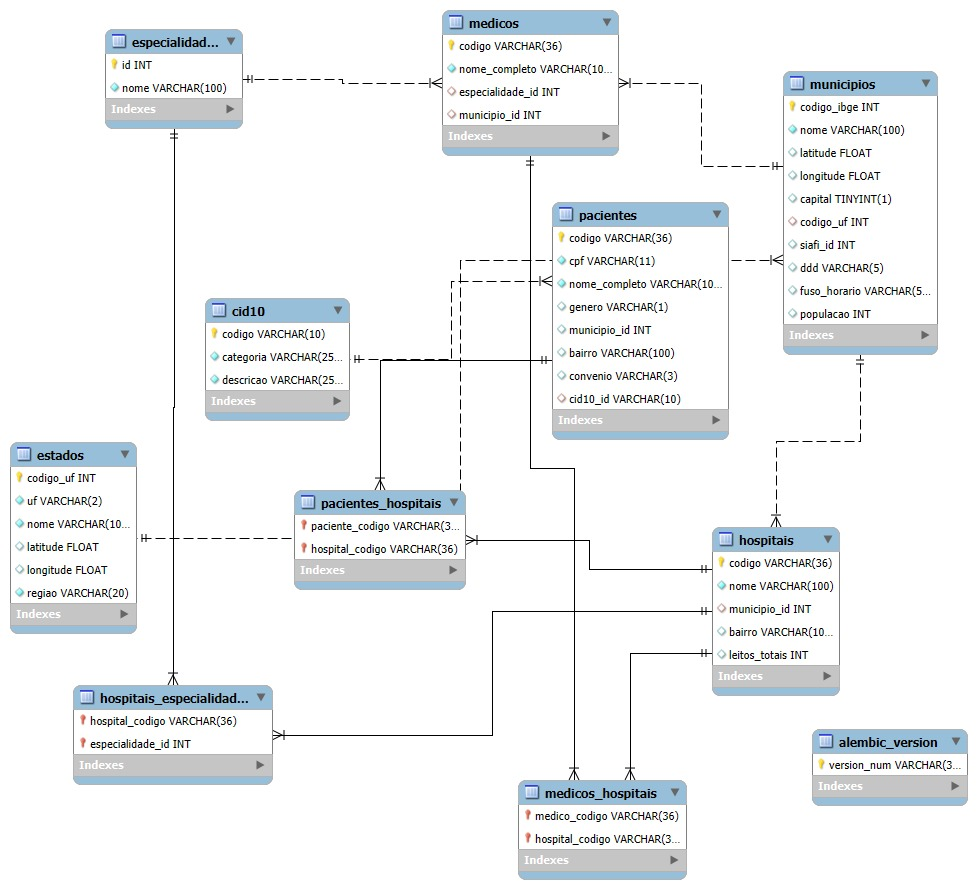

# 🏥 ChallengePremiersoft - Gestão Hospitalar  

Projeto desenvolvido durante o **#ChallengePremiersoft Hackathon**, com foco em **inovação na saúde**.  
O sistema facilita o **gerenciamento hospitalar**, automatizando a **inserção de dados a partir de planilhas**, estruturando-os em banco de dados e **gerando gráficos interativos** para análise e tomada de decisão.  

---

## 👨‍👩‍👧‍👦 Colaboradores
- **Gustavo R Bachmann** - [@CodeBachmann]  
- **Gabriel Dziecinny Ferreira** - [@GabrielDz27]  
- **Ana Beatriz Mendes** - [@mendesanabeatrz]  

---

## ⚙️ Tecnologias Utilizadas
- **Linguagem:** Python 🐍  
- **Banco de Dados:** MySQL 🗄️  
- **Backend:** FastAPI ⚡  
- **Frontend:** Streamlit 📊  
- **Containerização:** Docker & Docker Compose 🐳  

---

## 📂 Estrutura do Projeto

```
CHALLENGEPREMIERSOFT/
│── BackEnd/
│   ├── alembic/                # Migrações do banco de dados
│   ├── api/                    # Endpoints da API
│   ├── core/                   # Configurações principais
│   ├── models/                 # Modelos do banco de dados
│   ├── routers/                # Rotas do sistema
│   ├── schemas/                # Validações (Pydantic)
│   ├── sheet/                  # Processamento de planilhas
│   ├── database.py             # Conexão com o banco
│   ├── init_db.py              # Inicialização do banco
│   ├── main.py                 # Ponto de entrada do backend
│   ├── processa_planilhas.py   # Lógica de leitura das planilhas
│   ├── requirements.txt        # Dependências do backend
│   └── Dockerfile              # Container do backend
│
│── FrontEnd/
│   ├── paginas/                # Páginas da aplicação
│   ├── app.py                  # Ponto de entrada do frontend
│   ├── requirements.txt        # Dependências do frontend
│   └── Dockerfile              # Container do frontend
│
│── scripts/                    # Scripts auxiliares
│── docker-compose.yml          # Orquestração dos containers
│── README.md                   # Documentação
```

---

## 🗃️ Modelo de Banco de Dados  

Abaixo o **diagrama entidade-relacionamento (DER)** utilizado no sistema:  

  

---

## ▶️ Como Rodar Localmente  

1. Clone o repositório:  
   ```bash
   git clone <url-do-repositorio>
   cd CHALLENGEPREMIERSOFT
   ```

2. Suba os containers com o Docker Compose:  
   ```bash
   docker-compose up --build
   ```

3. Acesse os serviços:  
   - **Frontend:** [http://localhost:8501](http://localhost:8501)  
   - **Backend (API):** [http://localhost:8000/docs](http://localhost:8000/docs)  

---

## 🏗️ Arquitetura  

O sistema foi estruturado em dois módulos principais:  

- **Backend (FastAPI + MySQL):** processa planilhas, insere dados no banco e fornece endpoints.  
- **Frontend (Streamlit):** exibe dashboards interativos e relatórios gráficos.  

Fluxo de comunicação:  

```
Usuário → Frontend (Streamlit) → Backend (FastAPI) → Banco MySQL
```

---

## 📋 Checklist de Usabilidade (Critérios de Avaliação)  

- ✅ **README:** explica claramente como rodar o projeto passo a passo.  
- ✅ **Deploy:** containers sobem facilmente com `docker-compose up --build`.  
- ✅ **Arquitetura:** documentada (diagrama do banco + explicação dos módulos).  
- ✅ **API:** endpoints documentados automaticamente pelo **Swagger** em [http://localhost:8000/docs](http://localhost:8000/docs).  

<<<<<<< Updated upstream
<<<<<<< Updated upstream
---
=======
=======
>>>>>>> Stashed changes
---

## 🚀 Próximos Passos
- Implementação de autenticação e níveis de acesso.  
- Melhorias na análise de dados com dashboards avançados.  
- Integração com APIs de saúde externas (ex: DATASUS).  
<<<<<<< Updated upstream
>>>>>>> Stashed changes
=======
>>>>>>> Stashed changes
